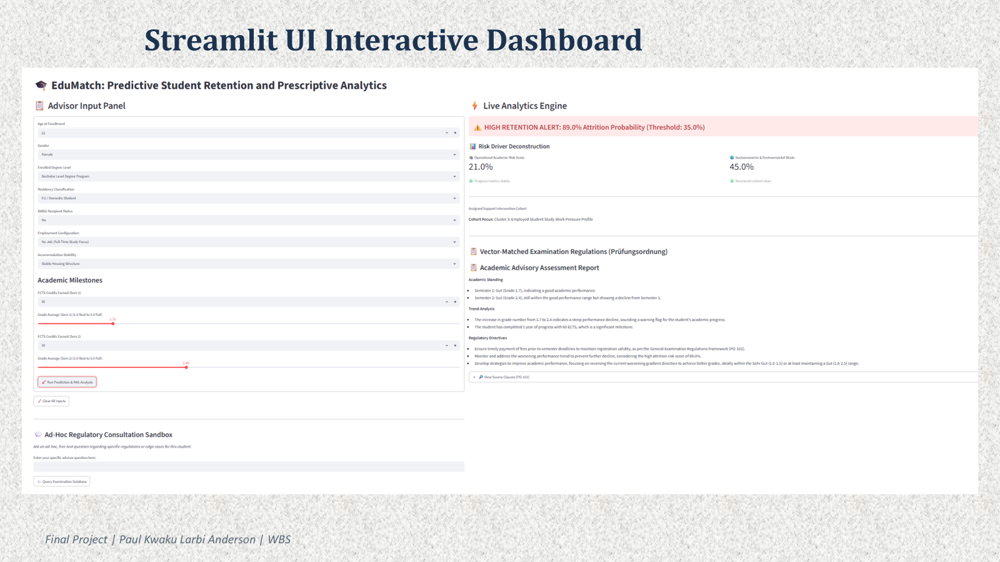

# EduMatch: Predictive Student Retention & Prescriptive Advisory Pipeline

## 🚀 Project Overview

EduMatch is an end-to-end predictive analytics and advisory dashboard designed to combat early student attrition. By combining machine learning (supervised classification and unsupervised clustering) with Retrieval-Augmented Generation (RAG), EduMatch transitions educational institutions from reactive "post-failure" monitoring to proactive, policy-backed student support.

This project enables academic advisors to:

* **Identify At-Risk Students:** Use a trained Random Forest classifier to predict "Exmatriculation" (dropout) risk before it happens.
* **Segment for Intervention:** Utilize K-Means clustering to route at-risk students into specific support tracks (e.g., Financial Aid, Academic Tutoring, or Mentorship).
* **Provide Regulatory Guidance:** Leverage a local RAG engine to instantly retrieve context-matched institutional policies (Prüfungsordnung) to support student outreach.

## 🛠️ Technology Stack

* **Languages:** Python 3.10+
* **Machine Learning:** Scikit-Learn (Random Forest, K-Means, RobustScaler)
* **Generative AI:** Groq API (Llama-3.1-8b-instant), TF-IDF (Semantic Vector Search)
* **UI/Dashboard:** Streamlit
* **Data Processing:** Pandas, NumPy, SQLite3
* **Environment:** Jupyter Notebook (Development), Streamlit (Deployment)

## 🏗️ Project Architecture (Phases)

1. **Data Engineering:** Ingestion, cleaning, and mapping raw student survey data to localized German higher education metrics (e.g., ECTS conversion, BAföG status).
2. **Exploratory Data Analysis (EDA):** Statistical diagnostics to identify socioeconomic and academic stress vectors (e.g., Work-Study pressure, Credit Milestones).
3. **Predictive Modeling (Supervised):** Training a Random Forest classifier to output student attrition risk probabilities.
4. **Strategic Segmentation (Unsupervised):** Using K-Means to partition at-risk students into specific, actionable support personas.
5. **Regulatory Knowledge Base (RAG):** Indexing institutional examination regulations (Prüfungsordnung) for automated, context-aware policy retrieval.
6. **Production Dashboard:** A unified Streamlit UI delivering real-time risk predictions, persona assignments, and AI-generated intervention briefs.

## 📋 Key Features

* **Explainable AI (XAI):** Decisions are mapped back to specific feature importances and institutional policies, avoiding "black-box" predictions.
* **Context-Aware Advice:** The LLM integrates student-specific risk vectors (e.g., "high credit deficit," "student-worker") with institutional legal clauses to draft tailored outreach emails.
* **Proactive Thresholding:** Uses a custom 0.40 probability threshold to prioritize Recall, ensuring high-risk students are caught early.

## 🚀 How to Run

1. **Clone the Repository:** `git clone [https://github.com/Pakanderson/edumatch-student-retention]`
2. **Install Dependencies:** `pip install -r requirements.txt`
3. **Environment Setup:** Create a `.secrets.toml` file and add your `GROQ_API_KEY`.
4. **Run the Dashboard:** `streamlit run the_edumatch_app.py`

## 🎓 Academic Impact

This pipeline provides university advisors with a "glass-box" tool that bridges the gap between raw data and human empathy. By automating the technical detection of risk and the retrieval of relevant policies, advisors can spend more time on meaningful student interaction.

## Dashboard Preview

